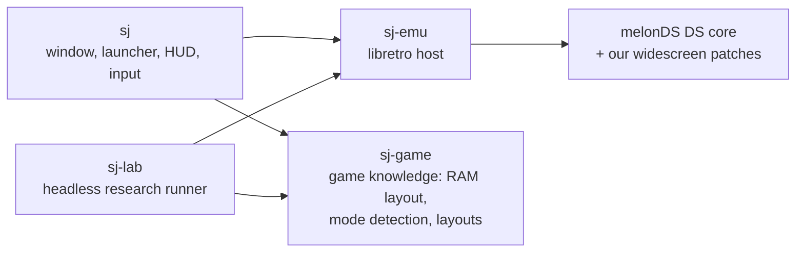

# sj-pc

[](https://github.com/BeubeuCode/sj-pc/actions/workflows/ci.yml)
[](LICENSE)

A single-screen PC version of *Shin Megami Tensei: Strange Journey* (Nintendo DS, USA) for macOS,
Linux and Windows.

The game runs on the [melonDS DS](https://github.com/JesseTG/melonds-ds) libretro core. On top of it,
a Rust frontend reverse-engineers the game piece by piece and rebuilds what the DS split over two
screens, so the whole game plays on one modern screen: widescreen 3D, native battle panels, a minimap,
60fps where the hardware held it back. Later steps replace the game's interface with native code and
open it to mods.

You need your own dump of the game. Nothing from the game is in this repository.

## Features
- **One screen.** The frontend reads the game's state from memory (dungeon, battle, menu, dialogue)
  and picks the layout: the top screen alone while exploring and fighting, both screens side by side
  in menus. A swap key shows the bottom screen whenever you need it.
- **Widescreen 3D.** Dungeons and battles render in 16:9; the 2D interface stays 4:3 in the middle,
  with the moon phase, the Analyze gauge and the command menu moved out to the edges.
- **Native battle panels.** Enemy, party and Summon pages replace the bottom screen, drawn in the
  game's own style: name, level, HP and MP bars, race, weaknesses and resistances, skills.
- **60fps.** Battles and dungeons run at 60. The ship and its facilities, which the game draws at 30,
  run at 60 too while only the top screen is on show.
- **Minimap** in the corner while exploring, hidden during dialogue.
- **Comfort.** Launcher with ROM check and drag-and-drop, keyboard and controller rebinding,
  10 savestate slots plus an autosave every 5 minutes, a load/save menu at the top edge of the window,
  fast-forward, 1x to 8x internal resolution.

See [docs/ROADMAP.md](docs/ROADMAP.md) for what is done and what is next.

## Status
Playable, under active development. Built and played on macOS; Linux and Windows builds are untested.
Menus still show both screens side by side.

## Getting started
You need Rust (stable, via rustup), CMake 3.20+, a C/C++ compiler and Git. Platform details are in
[docs/BUILDING.md](docs/BUILDING.md).

```sh
git clone --recursive https://github.com/BeubeuCode/sj-pc.git
cd sj-pc
mkdir -p roms && cp /path/to/your/dump.nds roms/sj_usa.nds   # Strange Journey USA (BMTE)
./scripts/build-core.sh                      # once: builds the patched core into cores/
cargo run --release                          # opens the launcher
```

Press **Play** in the launcher, or start straight into the game with `cargo run --release -- --play`.
Settings are saved to `sj.toml`; every key is described in [docs/CONFIG.md](docs/CONFIG.md).

## Controls
| DS button | Keyboard | Controller | In the game |
|---|---|---|---|
| A | Enter, Space | A | confirm |
| B | Backspace | B | back |
| Y | Escape | Y | main menu |
| X | Tab | X | mission log |
| L / R | Q / E | LB / RB | automap floor |
| D-pad | WASD, arrows | d-pad, left stick | move and turn |

| Action | Key |
|---|---|
| Swap to the bottom screen | M (right stick click on a controller) |
| Save / load state | F5 / F8 (F6, F7 change slot) |
| Fast-forward (hold) | `` ` `` |
| Fullscreen | F11 |
| Load or save any state | move the mouse to the top edge |

Everything can be rebound in the launcher.

## How it works


- `crates/sj-game` holds everything we know about the game, as pure, tested code: memory addresses,
  game-mode detection, battle and demon data, screen layouts. All game memory access goes through
  its `GameApi` trait, the future mod surface.
- `crates/sj-emu` loads the libretro core and talks to it.
- `crates/sj` is the application: SDL window, OpenGL presentation, egui launcher and overlays.
- `crates/sj-lab` runs the game headless from scripts and snapshots RAM and screens; it is how most
  of the reverse engineering is done.
- `patches/` holds our changes to melonDS and melonDS DS (widescreen 3D).

[docs/ARCHITECTURE.md](docs/ARCHITECTURE.md) has the full picture.

## Documentation
| Page | What it covers |
|---|---|
| [ROADMAP](docs/ROADMAP.md) | Milestones and progress |
| [BUILDING](docs/BUILDING.md) | Toolchains per platform, the core build, our core patches |
| [CONFIG](docs/CONFIG.md) | Every setting, controls and hotkeys |
| [ARCHITECTURE](docs/ARCHITECTURE.md) | Crates, frame loop, screen director, research tooling |
| [DECISIONS](docs/DECISIONS.md) | Why things are the way they are |
| [STYLE](docs/STYLE.md) | Code style |
| [HOOKS](docs/HOOKS.md) | Planned code hooks for the native interface |
| [Reverse engineering](docs/re/README.md) | Memory map, symbols, widescreen notes, research recipes |

## Contributing
See [CONTRIBUTING.md](CONTRIBUTING.md). The one rule that matters most: never commit anything taken
from the game (ROM, extracted files, graphics, text, disassembly). Addresses and names are fine.

## Legal
This is a fan project, not affiliated with or endorsed by Atlus or SEGA. *Shin Megami Tensei* and
*Strange Journey* are trademarks of their owners. The repository contains no game code or data; you
must provide a dump of a cartridge you own.

## License
[GPL-3.0-or-later](LICENSE), the license of melonDS and melonDS DS, which our core patches modify.

Built on [melonDS](https://github.com/melonDS-emu/melonDS),
[melonDS DS](https://github.com/JesseTG/melonds-ds), [SDL2](https://www.libsdl.org/) and
[egui](https://github.com/emilk/egui).
